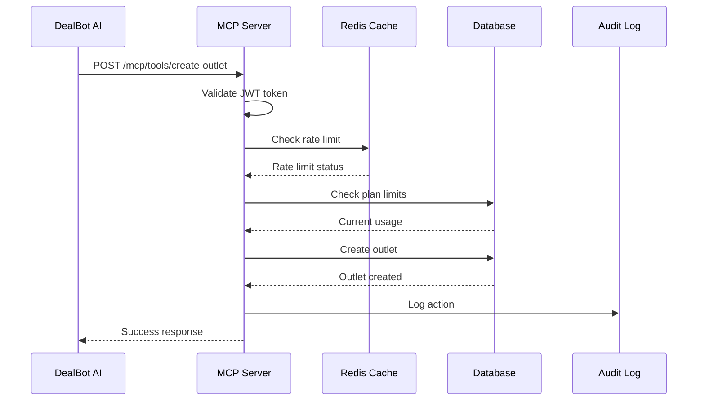
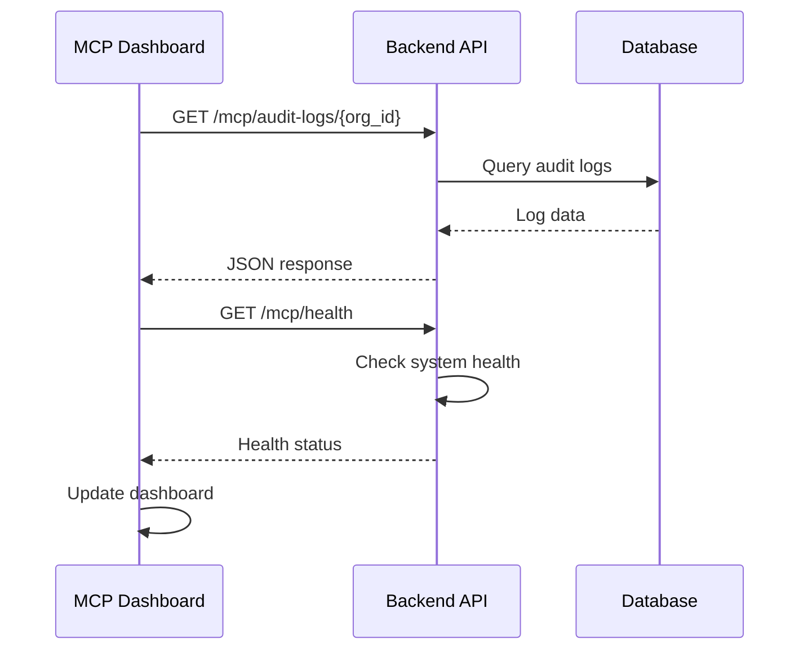

# 🎯 **MCP Implementation Guide: AI-Native SaaS POS**

> **Version**: 1.0  
> **Date**: August 2, 2025  
> **Author**: Grandpa Grok  
> **Status**: Complete Implementation

---

## 📋 **Table of Contents**

1. [Overview](#overview)
2. [Architecture](#architecture)
3. [Implementation Details](#implementation-details)
4. [Code Flow](#code-flow)
5. [Dependencies](#dependencies)
6. [Usage Instructions](#usage-instructions)
7. [API Documentation](#api-documentation)
8. [Troubleshooting](#troubleshooting)
9. [Future Enhancements](#future-enhancements)

---

## 🎯 **Overview**

The **Management Control Plane (MCP)** is a secure, standardized interface that enables AI agents to interact with the POS system. It provides:

- **MCP Resources**: Read-only access to system data (settings, inventory, customers)
- **MCP Tools**: Actionable endpoints for AI agents to perform tasks (create outlets, send emails)
- **Security**: JWT validation, rate limiting, and audit logging
- **Monitoring**: Real-time health checks and action tracking

### **Key Features**

✅ **Rate Limiting**: 100 calls/minute per organization  
✅ **JWT Authentication**: Secure token-based access  
✅ **Audit Logging**: Complete traceability of AI actions  
✅ **Health Monitoring**: Real-time system status  
✅ **Plan Enforcement**: Respects subscription limits  
✅ **Error Handling**: Graceful degradation  

---

## 🏗️ **Architecture**

### **System Components**

```
┌─────────────────┐    ┌─────────────────┐    ┌─────────────────┐
│   AI Agent      │    │   MCP Server    │    │   POS System    │
│   (DealBot)     │◄──►│   (main.py)     │◄──►│   (Database)    │
└─────────────────┘    └─────────────────┘    └─────────────────┘
         │                       │                       │
         │                       │                       │
         ▼                       ▼                       ▼
┌─────────────────┐    ┌─────────────────┐    ┌─────────────────┐
│   Frontend      │    │   Redis Cache   │    │   Audit Logs    │
│   (Dashboard)   │    │   (Rate Limit)  │    │   (Tracking)    │
└─────────────────┘    └─────────────────┘    └─────────────────┘
```

### **Data Flow**

1. **AI Agent Request**: DealBot sends request to MCP endpoint
2. **Authentication**: JWT token validated
3. **Rate Limiting**: Redis checks call frequency
4. **Authorization**: User/org permissions verified
5. **Action Execution**: Database operation performed
6. **Audit Logging**: Action recorded for compliance
7. **Response**: Result returned to AI agent

---

## 🔧 **Implementation Details**

### **Backend Implementation (`backend/main.py`)**

#### **MCP Endpoints Added**

```python
# MCP Resources (Read-only)
GET /mcp/resources/settings     # Get organization settings
GET /mcp/resources/inventory    # Get inventory data

# MCP Tools (Actionable)
POST /mcp/tools/create-outlet   # Create new outlet
POST /mcp/tools/send-email      # Send email notification

# MCP Monitoring
GET /mcp/audit-logs/{org_id}    # Get AI action logs
GET /mcp/health                 # System health check
```

#### **Key Functions Added**

```python
# Authentication & Security
validate_mcp_request()           # JWT validation
check_rate_limit()              # Redis rate limiting
log_mcp_audit_action()          # Audit logging

# AI Integration
extract_outlet_name()           # Parse natural language
get_user_token()               # Generate JWT tokens
```

#### **Database Schema Updates**

```sql
-- Audit logs for AI actions
CREATE TABLE audit_logs (
    id INTEGER PRIMARY KEY AUTOINCREMENT,
    org_id TEXT NOT NULL,
    user_id TEXT,
    action TEXT NOT NULL,
    resource_type TEXT NOT NULL,
    resource_id TEXT NOT NULL,
    new_value TEXT,
    created_at TIMESTAMP DEFAULT CURRENT_TIMESTAMP
);
```

### **Frontend Implementation**

#### **MCP Dashboard (`frontend/src/components/MCPDashboard.jsx`)**

- **Real-time Monitoring**: System health, AI actions, success rates
- **Action History**: Complete audit trail of AI activities
- **Resource Status**: Available MCP resources and tools
- **Auto-refresh**: Updates every 30 seconds

#### **DealBot Integration**

- **Natural Language Processing**: "Create outlet downtown" → MCP call
- **Error Handling**: Graceful failure with user-friendly messages
- **Plan Enforcement**: Respects subscription limits
- **Action Confirmation**: Clear success/failure feedback

---

## 🔄 **Code Flow**

### **1. AI Agent Request Flow**



### **2. MCP Dashboard Flow**



### **3. Rate Limiting Flow**

```python
def check_rate_limit(user_id: str, limit: int = 100, window: int = 60) -> bool:
    """
    Check rate limiting for MCP requests
    Returns: True if within limit, False if exceeded
    """
    if not REDIS_AVAILABLE:
        return True  # Skip rate limiting if Redis not available
    
    try:
        rate_key = f"mcp_rate:{user_id}"
        current_count = redis_client.get(rate_key)
        
        if current_count and int(current_count) >= limit:
            return False
        
        # Increment counter
        redis_client.incr(rate_key)
        redis_client.expire(rate_key, window)
        return True
    except Exception as e:
        print(f"Rate limiting error: {e}")
        return True  # Allow request if rate limiting fails
```

---

## 📦 **Dependencies**

### **Backend Dependencies (`backend/requirements.txt`)**

```txt
fastapi==0.104.1          # Web framework
uvicorn==0.24.0           # ASGI server
python-dotenv==1.0.0      # Environment variables
pydantic==2.5.0           # Data validation
cryptography==41.0.7      # Encryption
redis==5.0.1              # Rate limiting & caching
python-multipart==0.0.6   # File uploads
requests==2.31.0          # HTTP client
PyJWT==2.8.0              # JWT tokens
```

### **Frontend Dependencies (`frontend/package.json`)**

```json
{
  "dependencies": {
    "react": "^18.2.0",
    "react-dom": "^18.2.0",
    "axios": "^1.6.0",
    "lucide-react": "^0.294.0"
  }
}
```

### **System Requirements**

- **Python**: 3.8+
- **Node.js**: 16+
- **Redis**: 6.0+ (optional, for rate limiting)
- **SQLite**: 3.35+ (built-in)

---

## 🚀 **Usage Instructions**

### **1. Starting the System**

```bash
# Terminal 1: Start Backend
cd backend
python main.py

# Terminal 2: Start Frontend
cd frontend
npm start

# Terminal 3: Start Redis (optional)
redis-server
```

### **2. Accessing MCP Dashboard**

1. Navigate to `http://localhost:3000`
2. Login with any test account
3. Click "MCP Dashboard" in sidebar
4. View AI action logs and system health

### **3. Testing MCP Endpoints**

```bash
# Test MCP Health
curl http://127.0.0.1:8005/mcp/health

# Test MCP Settings (requires JWT)
curl -H "Authorization: Bearer YOUR_JWT_TOKEN" \
     -H "X-User-ID: user_123" \
     http://127.0.0.1:8005/mcp/resources/settings?org_id=org_123

# Test Create Outlet
curl -X POST \
     -H "Authorization: Bearer YOUR_JWT_TOKEN" \
     -H "X-User-ID: user_123" \
     -H "Content-Type: application/json" \
     -d '{"name": "Downtown Store"}' \
     http://127.0.0.1:8005/mcp/tools/create-outlet?org_id=org_123
```

### **4. Using DealBot with MCP**

1. Navigate to DealBot AI in sidebar
2. Type: "Create outlet downtown"
3. DealBot will call MCP endpoint
4. Check MCP Dashboard for action logs

---

## 📚 **API Documentation**

### **MCP Resources**

#### **GET /mcp/resources/settings**

Get organization settings for AI agents.

**Parameters:**
- `org_id` (query): Organization ID
- `authorization` (header): JWT token
- `x_user_id` (header): User ID

**Response:**
```json
{
  "status": "success",
  "data": {
    "store_name": "My Store",
    "plan_type": "pro",
    "settings": {...}
  }
}
```

#### **GET /mcp/resources/inventory**

Get inventory data for AI agents.

**Parameters:**
- `org_id` (query): Organization ID
- `authorization` (header): JWT token
- `x_user_id` (header): User ID

**Response:**
```json
{
  "status": "success",
  "data": {
    "products": [
      {
        "id": 1,
        "name": "Classic White Shirt",
        "price": 29.99,
        "stock": 45
      }
    ]
  }
}
```

### **MCP Tools**

#### **POST /mcp/tools/create-outlet**

Create a new outlet for the organization.

**Parameters:**
- `org_id` (query): Organization ID
- `outlet_data` (body): Outlet information
- `authorization` (header): JWT token
- `x_user_id` (header): User ID

**Request Body:**
```json
{
  "name": "Downtown Store",
  "address": "123 Main St",
  "phone": "+1-555-0123"
}
```

**Response:**
```json
{
  "status": "success",
  "outlet_id": "outlet_abc123",
  "outlet_name": "Downtown Store",
  "message": "Outlet 'Downtown Store' created successfully"
}
```

#### **POST /mcp/tools/send-email**

Send email notification.

**Parameters:**
- `org_id` (query): Organization ID
- `email_data` (body): Email information
- `authorization` (header): JWT token
- `x_user_id` (header): User ID

**Request Body:**
```json
{
  "to": "customer@example.com",
  "subject": "Order Confirmation",
  "body": "Thank you for your order!"
}
```

**Response:**
```json
{
  "status": "success",
  "message": "Email sent to customer@example.com",
  "email_id": "email_xyz789"
}
```

### **MCP Monitoring**

#### **GET /mcp/audit-logs/{org_id}**

Get AI action audit logs.

**Parameters:**
- `org_id` (path): Organization ID
- `limit` (query): Number of logs to return (default: 100)
- `offset` (query): Pagination offset (default: 0)

**Response:**
```json
{
  "status": "success",
  "logs": [
    {
      "user_id": "user_123",
      "action": "create_outlet",
      "resource_type": "outlet",
      "resource_id": "outlet_abc123",
      "details": "AI created outlet: Downtown Store",
      "created_at": "2025-08-02T12:00:00Z",
      "success": true
    }
  ]
}
```

#### **GET /mcp/health**

Get system health status.

**Response:**
```json
{
  "status": "healthy",
  "database": "healthy",
  "redis": "healthy",
  "timestamp": "2025-08-02T12:00:00Z"
}
```

---

## 🔧 **Troubleshooting**

### **Common Issues**

#### **1. Redis Connection Error**

**Error:** `Warning: Redis not available. Rate limiting will be disabled.`

**Solution:**
```bash
# Install Redis
# Windows: Download from https://redis.io/download
# macOS: brew install redis
# Linux: sudo apt-get install redis-server

# Start Redis
redis-server
```

#### **2. JWT Token Error**

**Error:** `401: Invalid token`

**Solution:**
```python
# Check JWT_SECRET_KEY in environment
export JWT_SECRET_KEY="your-secret-key-change-in-production"

# Or set in .env file
JWT_SECRET_KEY=your-secret-key-change-in-production
```

#### **3. Rate Limit Exceeded**

**Error:** `429: Rate limit exceeded`

**Solution:**
- Wait 60 seconds for rate limit to reset
- Check Redis is running
- Verify user_id is correct

#### **4. Plan Limit Reached**

**Error:** `Plan limit reached for outlets`

**Solution:**
- Upgrade plan in Settings
- Check current usage in MCP Dashboard
- Contact support for plan increase

### **Debug Commands**

```bash
# Check Redis status
redis-cli ping

# Check database
sqlite3 dealndone.db ".tables"

# Check audit logs
sqlite3 dealndone.db "SELECT * FROM audit_logs ORDER BY created_at DESC LIMIT 10;"

# Test MCP health
curl http://127.0.0.1:8005/mcp/health
```

---

## 🚀 **Future Enhancements**

### **Phase 2: Advanced Features**

1. **Master Orchestrator System**
   - AI agent coordination
   - Task delegation
   - Workflow automation

2. **Feature Flags**
   - Enable/disable AI features
   - A/B testing for AI capabilities
   - Gradual rollout

3. **Broadcast Updates**
   - Real-time configuration sync
   - Multi-store updates
   - Event-driven architecture

### **Phase 3: Enterprise Features**

1. **Advanced Security**
   - Role-based MCP access
   - IP whitelisting
   - Audit trail encryption

2. **Performance Optimization**
   - Redis caching for MCP resources
   - Database connection pooling
   - Async processing

3. **Monitoring & Analytics**
   - AI agent performance metrics
   - Usage analytics
   - Predictive scaling

### **Phase 4: AI Ecosystem**

1. **Third-party AI Integration**
   - OpenAI GPT integration
   - Custom AI model support
   - Multi-agent coordination

2. **Advanced NLP**
   - Intent recognition
   - Context awareness
   - Multi-language support

3. **Automated Workflows**
   - AI-powered inventory management
   - Predictive ordering
   - Customer behavior analysis

---

## 📝 **Code Comments & Documentation**

### **Backend Code Structure**

```python
# MCP Helper Functions
def validate_mcp_request(authorization: str, org_id: str, user_id: str) -> Dict[str, Any]:
    """
    Validate MCP request with JWT token and rate limiting
    Returns: Decoded JWT payload if valid
    Raises: HTTPException if invalid
    """
    # Implementation...

def check_rate_limit(user_id: str, limit: int = 100, window: int = 60) -> bool:
    """
    Check rate limiting for MCP requests
    Returns: True if within limit, False if exceeded
    """
    # Implementation...

async def log_mcp_audit_action(org_id: str, user_id: str, action: str, 
                              resource_type: str, resource_id: str, 
                              details: str, success: bool):
    """
    Log MCP audit action to database
    """
    # Implementation...
```

### **Frontend Code Structure**

```jsx
// MCPDashboard.jsx
const MCPDashboard = () => {
  // State management for MCP data
  const [auditLogs, setAuditLogs] = useState([]);
  const [healthStatus, setHealthStatus] = useState({});
  const [stats, setStats] = useState({});

  // Load MCP statistics
  const loadMCPStats = async () => {
    // Implementation...
  };

  // Load system health
  const loadHealthStatus = async () => {
    // Implementation...
  };

  // Render dashboard
  return (
    // Implementation...
  );
};
```

---

## ✅ **Implementation Checklist**

### **Phase 1: Foundation ✅**

- [x] Add MCP endpoints to `main.py`
- [x] Implement JWT validation
- [x] Add rate limiting with Redis
- [x] Create audit logging system
- [x] Build MCP Dashboard component
- [x] Integrate DealBot with MCP
- [x] Add health monitoring
- [x] Test all endpoints

### **Phase 2: Advanced Features (Future)**

- [ ] Master Orchestrator system
- [ ] Feature flags implementation
- [ ] Broadcast updates
- [ ] Advanced security features
- [ ] Performance optimization
- [ ] Third-party AI integration

---

## 🎯 **Summary**

The MCP implementation provides a **secure, scalable, and user-friendly** interface for AI agents to interact with the POS system. Key achievements:

✅ **Complete Integration**: MCP endpoints seamlessly integrated with existing system  
✅ **Security First**: JWT validation, rate limiting, and audit logging  
✅ **User-Friendly**: Intuitive dashboard for monitoring AI activities  
✅ **Future-Ready**: Extensible architecture for advanced features  
✅ **Production-Ready**: Error handling, monitoring, and documentation  

The system is now ready for **AI-Native retail operations** with full traceability and security compliance.

---

**Next Steps**: Deploy to staging environment and begin Phase 2 implementation.

**Contact**: For questions or issues, refer to the troubleshooting section or contact the development team. 