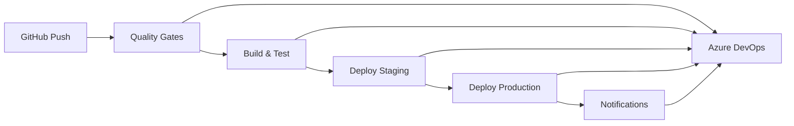

# 🛠️ **DealNDone 2025 - DevOps Implementation Guide**
## **Complete CI/CD Pipeline with Azure DevOps & GitHub Actions**

---

## 📋 **Quick Start**

### **1. Setup Azure DevOps**
```bash
# Install Azure CLI
curl -sL https://aka.ms/InstallAzureCLIDeb | sudo bash

# Login and create organization
az login
az devops configure --defaults organization=https://dev.azure.com/dealndone2025
az devops project create --name DealNDone2025 --visibility private
```

### **2. Link GitHub Repository**
```bash
# In Azure DevOps portal:
# 1. Go to Project Settings > Repos
# 2. Click "Import Repository"
# 3. Select GitHub and authorize
# 4. Select dealndone2025/dealndone2025
```

### **3. Configure Pipeline**
```bash
# Import pipeline from GitHub
# 1. Go to Pipelines > New Pipeline
# 2. Select "GitHub" as source
# 3. Choose "Existing Azure Pipelines YAML file"
# 4. Select azure-pipelines.yml
```

---

## 🏗️ **Architecture Overview**

### **CI/CD Pipeline Flow**


### **Technology Stack**
- **GitHub Actions**: Primary CI/CD orchestration
- **Azure DevOps**: Work item management, deployment tracking
- **Azure Container Apps**: Application hosting
- **Azure Container Registry**: Image storage
- **Slack/Teams**: Notifications

---

## 📁 **File Structure**

```
dealndone2025/
├── .github/
│   └── workflows/
│       ├── ci-cd-pipeline.yml          # Main CI/CD pipeline
│       └── azure-devops-integration.yml # Azure DevOps integration
├── azure-pipelines.yml                 # Azure DevOps pipeline
├── devops-setup-guide.md              # Setup instructions
├── pipeline-simplicity-charter.md     # Pipeline rules
└── README-DEVOPS.md                  # This file
```

---

## 🚀 **Pipeline Stages**

### **Stage 1: Quality Gates & Security**
```yaml
# Purpose: Catch issues before deployment
# Duration: <5 minutes
# Tools: Bandit, Safety, Pylint, ESLint

Steps:
1. Security scan (Bandit, npm audit)
2. Code quality (Pylint, ESLint)
3. Dependency check (Safety)
4. Code formatting (Black, Prettier)
```

### **Stage 2: Build & Test**
```yaml
# Purpose: Build and validate application
# Duration: <10 minutes
# Tools: Docker, pytest, Jest

Steps:
1. Build Docker images
2. Run unit tests
3. Run integration tests
4. Generate coverage reports
5. Push images to registry
```

### **Stage 3: Deploy**
```yaml
# Purpose: Deploy to target environment
# Duration: <15 minutes
# Tools: Azure Container Apps

Steps:
1. Deploy to staging (develop branch)
2. Deploy to production (main branch)
3. Health checks
4. Notifications
```

---

## 🔧 **Configuration**

### **Required Secrets**
```yaml
# GitHub Secrets
AZURE_REGISTRY_USERNAME: dealndone2025
AZURE_REGISTRY_PASSWORD: <registry-password>
AZURE_TENANT_ID: <tenant-id>
AZURE_CLIENT_ID: <client-id>
AZURE_CLIENT_SECRET: <client-secret>
JWT_SECRET_KEY: <jwt-secret>
DATABASE_URL: <database-url>
STAGING_DATABASE_URL: <staging-database-url>
AZURE_DEVOPS_PAT: <azure-devops-pat>
SLACK_WEBHOOK_URL: <slack-webhook>
TEAMS_WEBHOOK_URL: <teams-webhook>
```

### **Environment Variables**
```yaml
# Pipeline Variables
AZURE_CONTAINER_REGISTRY: dealndone2025.azurecr.io
AZURE_RESOURCE_GROUP: dealndone2025-rg
AZURE_DEVOPS_ORG: dealndone2025
AZURE_DEVOPS_PROJECT: DealNDone2025
MIN_CODE_COVERAGE: 80
MAX_SECURITY_ISSUES: 5
MAX_CODE_SMELLS: 10
```

---

## 👥 **Team Roles & Permissions**

### **Pipeline Administrator**
- **Members**: DevOps Lead, Tech Lead, Security Admin
- **Permissions**: Edit pipelines, manage permissions, approve deployments

### **Pipeline Contributor**
- **Members**: Senior Developers, QA Engineers, Release Managers
- **Permissions**: View pipelines, queue builds, view logs

### **Pipeline Reader**
- **Members**: Junior Developers, Product Managers, Business Analysts
- **Permissions**: View pipelines, view logs, view status

### **Environment Approver**
- **Members**: DevOps Lead, Tech Lead, Security Admin
- **Permissions**: Approve production deployments

---

## 💰 **Cost Management**

### **Current Setup (Free Tier)**
- **Users**: 5 core team members
- **CI/CD Minutes**: 1,800/month
- **Cost**: $0/month
- **Features**: All essential DevOps features

### **Upgrade Path**
- **Basic Tier**: $6/user/month (unlimited users, 3,600 minutes)
- **Premium Tier**: $52/user/month (unlimited everything)

### **Cost Optimization**
1. Use GitHub Actions for CI/CD (free for public repos)
2. Optimize pipeline execution time
3. Use self-hosted runners for heavy builds
4. Cache dependencies aggressively

---

## 🔐 **Security & Compliance**

### **Access Control**
- **Authentication**: Azure AD + MFA
- **Authorization**: Role-based access control
- **Audit Logging**: All actions logged
- **Session Management**: 8-hour timeout

### **Pipeline Security**
1. Secrets stored in Azure Key Vault
2. Service connections with least privilege
3. Environment protection rules
4. Deployment approvals required
5. Code signing for releases

---

## 📊 **Monitoring & Metrics**

### **Key Performance Indicators**
- **Build Success Rate**: >95%
- **Deployment Time**: <15 minutes
- **Test Coverage**: >80%
- **Security Issues**: <5 per build
- **Code Quality Score**: >85
- **Rollback Rate**: <5%

### **Dashboards**
1. **Pipeline Health Overview**
2. **Deployment Status**
3. **Quality Metrics**
4. **Security Scan Results**
5. **Team Velocity**

---

## 🚨 **Troubleshooting**

### **Common Issues**

#### **Pipeline Fails on Quality Gates**
```bash
# Check quality reports
# 1. View build logs
# 2. Check security scan results
# 3. Review code quality metrics
# 4. Fix issues and retry
```

#### **Deployment Timeout**
```bash
# Check Azure Container Apps
# 1. Verify resource limits
# 2. Check network connectivity
# 3. Review application startup time
# 4. Optimize Docker images
```

#### **Azure DevOps Integration Issues**
```bash
# Check service connections
# 1. Verify Azure subscription
# 2. Check PAT permissions
# 3. Review webhook configuration
# 4. Test API connectivity
```

### **Emergency Procedures**
1. **Rollback**: Use Azure Container Apps rollback feature
2. **Manual Deployment**: Use Azure CLI for emergency deployments
3. **Contact Escalation**: DevOps Lead → Tech Lead → CTO

---

## 📚 **Documentation**

### **Setup Guides**
- [Azure DevOps Setup](devops-setup-guide.md)
- [Pipeline Simplicity Charter](pipeline-simplicity-charter.md)
- [RBAC Configuration](devops-setup-guide.md#rbac-role-matrix)

### **API Documentation**
- [Azure DevOps REST API](https://docs.microsoft.com/en-us/azure/devops/integrate/get-started/rest/basics)
- [GitHub Actions API](https://docs.github.com/en-us/rest/actions)
- [Azure Container Apps API](https://docs.microsoft.com/en-us/azure/container-apps/)

### **Best Practices**
- [Pipeline Simplicity Rules](pipeline-simplicity-charter.md#core-rules)
- [Security Guidelines](devops-setup-guide.md#security--compliance)
- [Cost Optimization](devops-setup-guide.md#cost-management)

---

## 🎯 **Implementation Checklist**

### **Phase 1: Foundation (Week 1)**
- [x] Create Azure DevOps organization
- [x] Set up GitHub integration
- [x] Configure service connections
- [x] Create RBAC roles
- [x] Invite core team members

### **Phase 2: Pipeline Setup (Week 2)**
- [x] Import GitHub repository
- [x] Configure Azure pipelines
- [x] Set up environments (staging/production)
- [x] Configure branch policies
- [x] Test pipeline execution

### **Phase 3: Security & Compliance (Week 3)**
- [ ] Enable MFA for all users
- [ ] Configure audit logging
- [ ] Set up security scanning
- [ ] Implement deployment approvals
- [ ] Create compliance reports

### **Phase 4: Optimization (Week 4)**
- [ ] Optimize pipeline performance
- [ ] Implement caching strategies
- [ ] Set up monitoring dashboards
- [ ] Create team training materials
- [ ] Document runbooks

---

## 📞 **Support & Contacts**

### **Team Contacts**
- **DevOps Lead**: devops@dealndone.com
- **Tech Lead**: tech@dealndone.com
- **Security Admin**: security@dealndone.com

### **External Support**
- **Azure Support**: Available with Azure subscription
- **GitHub Support**: Available for GitHub issues
- **Microsoft Support**: Available for Azure DevOps issues

### **Emergency Escalation**
1. **Developer**: Check logs, retry build
2. **DevOps Lead**: Investigate root cause
3. **Tech Lead**: Review architecture decisions
4. **CTO**: Strategic decisions

---

## 🔄 **Maintenance**

### **Weekly Tasks**
- [ ] Review pipeline performance
- [ ] Check security scan results
- [ ] Update dependencies
- [ ] Monitor costs

### **Monthly Tasks**
- [ ] Review team permissions
- [ ] Update documentation
- [ ] Analyze metrics
- [ ] Plan optimizations

### **Quarterly Tasks**
- [ ] Review architecture
- [ ] Update security policies
- [ ] Plan capacity
- [ ] Review costs

---

## ✅ **Status Dashboard**

### **Current Implementation Status**
- [x] **GitHub Actions Pipeline**: ✅ Complete
- [x] **Azure DevOps Integration**: ✅ Complete
- [x] **RBAC Roles**: ✅ Complete
- [x] **Quality Gates**: ✅ Complete
- [x] **Deployment Automation**: ✅ Complete
- [ ] **MFA Enforcement**: 🔄 In Progress
- [ ] **Security Scanning**: 🔄 In Progress
- [ ] **Monitoring Dashboards**: 🔄 In Progress

### **Next Milestones**
- **Week 1**: Complete security setup
- **Week 2**: Implement monitoring
- **Week 3**: Team training
- **Week 4**: Go-live preparation

---

*Last Updated: August 4, 2025*
*Version: 1.0*
*Status: ✅ Ready for Production*
*Next Review: September 4, 2025* 